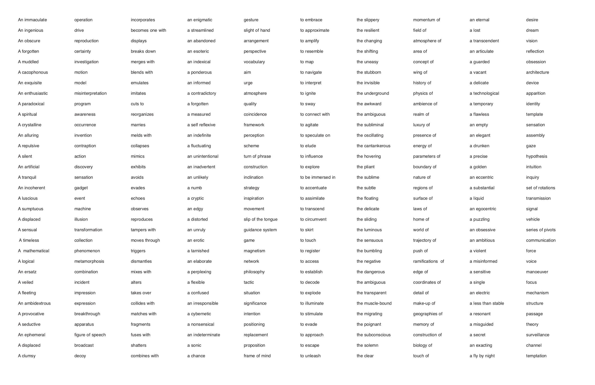

 

    

    <a href="https://drive.google.com/file/d/1ZCYbpO9ZfLXG50YvzTF1qaLLSfwstWsI/view?usp=sharing" title="Click to download" download >
         

         

         

         

         

         

         

         

         

         

         

         

         

        

        </a>
    

 
  

<h2>The Exquisite Mechanism of Shivers</h2>
<h2>Linear Video and Interactive Videodisc</h2>
<a href="https://drive.google.com/file/d/1dohbPzU39nXmSDs8zz7d2fi0TaHkXzAi/view?usp=sharing"><h3>Linear Audio</h3></a>
<a href="../images/portfolio/Ex.mech Notes.docx"><h3>Download Notes</h3></a>
<a href="../images/portfolio/EXText on the work.pdf"><h3>Download Text on the work</h3></a>
 
<iframe src='https://vimeo.com/showcase/7237643/embed' allowfullscreen frameborder='0' style='position:absolute;top:0;left:0;width:100%;height:100%;'></iframe>

 

    The second major interactive installation was entitled The Exquisite Mechanism of Shivers (1993). It should be noted that many of Seaman's works were shown in different states and /or alternate contexts. Each version of the work informs other versions in varying ways i.e. this work appears as an interactive installation with a single projection, a 10 screen video wall version, a Japanese/English Version - Ex.Mech (1994), 30 minute linear video as well as a CD Rom version that was published in Artintact 1 (1994). The work explores the construction of an audio/visual sentence with 10 segments. Each segment has a related piece of music, a specific spoken piece of text and time-based section of video. The template of the work has 33 variables for each modular section of the audio/visual sentence - thus the linear work is comprised of 33 sentences. Interactive versions of the work enable the user of the system to substitute different modular variables and generate new audio visual "sentences". These substitutions always facilitate the generation of a grammatically correct sentence. Because each of these modules is poly-valent in terms of their meaning, the work is always emergent. One can also use automated chance methods to derive new audio/visual sentences. A linear video also exists with this title and date.

 

 
