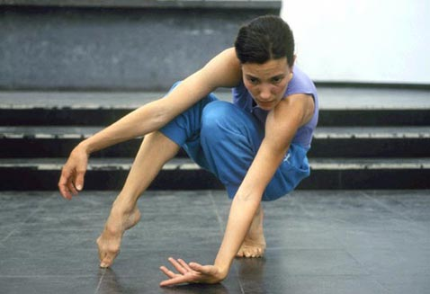
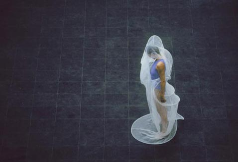
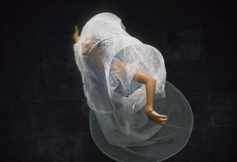
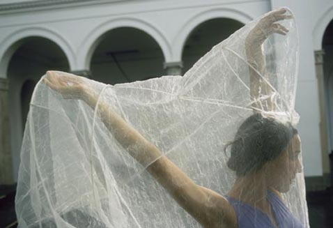
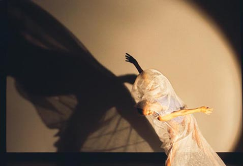
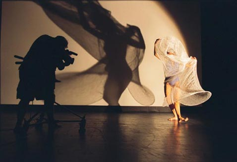
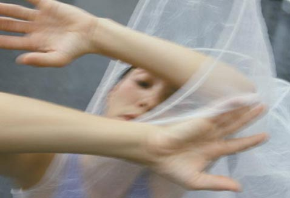
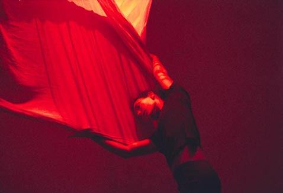
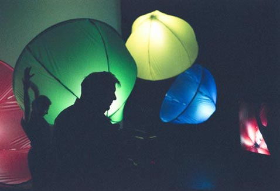

 

    

    <!-- <a href="https://drive.google.com/file/d/1ZCYbpO9ZfLXG50YvzTF1qaLLSfwstWsI/view?usp=sharing" title="Click to download" download > -->
         

         

         

         

         

         

         

         

         

         

        

        </a>
    

 
  

<h2>Inversion</h2>
 
<a href="../images/portfolio/ inversion - Poetic Text.pdf"><h3>Download Poetic Text</h3></a>
<a href="../images/portfolio/DNA - notes for Inversion.doc"><h3>Download Note 1</h3></a>
<a href="../images/portfolio/Inversion Notes - Nano.doc"><h3>Download Note 2</h3></a>
<a href="https://billseaman.bandcamp.com/album/inversion"><h3>Audio</h3></a>
 
 

<iframe src='https://vimeo.com/showcase/6999711/embed' allowfullscreen frameborder='0' style='position:absolute;top:0;left:0;width:100%;height:100%;'></iframe>

 
 

    Inversion (2001) is a major dance/performance/
    installation, a collaboration with the Dancer/
    Choreographer Regina van Berkel that explores the
    topic of Nanotechnology through a poetic text, a
    musical score, multiple computer-based projections,
    two linear videotapes, a set of sculptural
    elements, and variable lighting. The hour-long work
    was choreographed in relation to the musical score.
    All images, the lights and dance fall in perfect
    counterpoint with the music.

 
 

